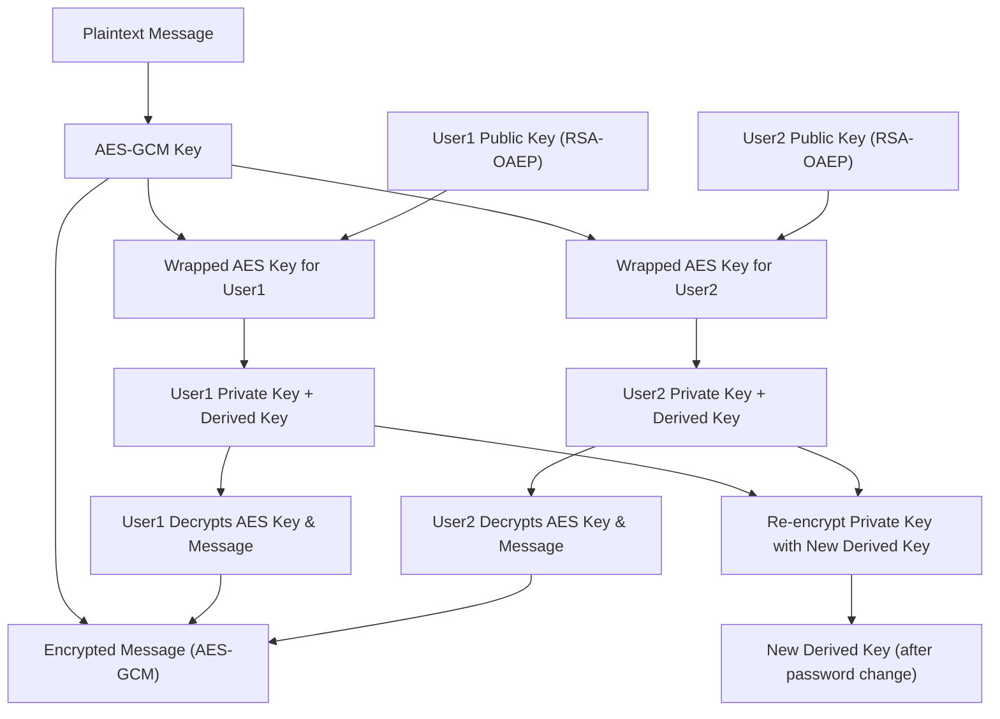

# @jagad.cloud/crypto (Secure Crypto Library)

`@jagad.cloud/crypto` adalah library JavaScript/TypeScript yang memanfaatkan **Web Crypto API** untuk enkripsi pesan, manajemen kunci, dan komunikasi multi-user yang aman. Cocok untuk aplikasi web yang membutuhkan standar keamanan tinggi.

---

## 🔑 Fitur Utama

* Device-specific key untuk menambah keamanan
* Password-derived AES keys
* RSA key pair untuk wrap/unwrap AES keys
* Enkripsi/dekripsi private key
* Multi-user secure messaging
* Re-encrypt private key saat password diganti
* Standar internasional & praktik terbaik keamanan

---

## 🔐 Keamanan & Praktik Terbaik

* **Device Key:**

  * Tidak bisa diexport → menambah entropy unik per device
* **AES-GCM:**

  * IV random + tag 128-bit → menjamin integritas pesan
* **RSA-OAEP:**

  * Wrap/unwrap AES key aman untuk multi-user
* **PBKDF2:**

  * 200.000 iterasi → proteksi password yang kuat
* **Multi-user Support:**

  * Tanpa mengekspos private key ke server atau user lain

> Semua praktik di atas mengikuti standar industri internasional, termasuk rekomendasi NIST dan W3C untuk Web Crypto API.

---

## 📦 Instalasi

1. **Pasang library (npm/yarn/pnpm)**

```bash
npm install @jagad.cloud/crypto
# atau
yarn add @jagad.cloud/crypto
# atau
pnpm add @jagad.cloud/crypto
```

---

## 🔑 Daftar Fungsi & Penggunaan

### 1. `ensureDeviceKey()`

* Membuat device-specific secret key (32 bytes) & menyimpannya di IndexedDB.
* Jika device key sudah ada, dikembalikan dari storage.

```ts
const deviceKey = await ensureDeviceKey();
console.log(deviceKey.byteLength); // 32
```

### 2. `deriveKeyFromPassword(password, salt)`

* Menghasilkan AES-GCM key dari password + salt + deviceKey.
* PBKDF2 dengan 200.000 iterasi, hash SHA-256.

```ts
const derivedKey = await deriveKeyFromPassword("password123", "salt-test");
console.log(derivedKey.type); // secret
```

### 3. `generateKeyPair()`

* Membuat RSA key pair untuk user (wrap/unwrap AES key).

```ts
const { publicKey, privateKeyRaw } = await generateKeyPair();
```

### 4. `encryptPrivateKey(privateKeyRaw, derivedKey)`

* Mengenkripsi private key dengan AES-GCM derived key.

```ts
const encryptedPrivateKey = await encryptPrivateKey(privateKeyRaw, derivedKey);
```

### 5. `decryptPrivateKey(encryptedPackage, derivedKey)`

* Mendekripsi private key yang terenkripsi.

```ts
const privKey = await decryptPrivateKey(encryptedPrivateKey, derivedKey);
console.log(privKey.type); // private
```

### 6. AES Utilities

```ts
const aesKey = await generateAesKey();
const { ciphertext, iv } = await encryptText("Halo dunia!", aesKey);
const decrypted = await decryptText(ciphertext, iv, aesKey);
```

* `wrapAesKey(aesKey, publicKey)` → Enkripsi AES key dengan RSA-OAEP
* `unwrapAesKey(wrappedKey, privateKey)` → Dekripsi AES key

---

### 7. Multi-user Secure Messaging

* Setiap user memiliki public key & encrypted private key
* Pesan dienkripsi dengan AES key
* AES key dienkripsi (wrap) untuk public key masing-masing user
* Hanya user dengan private key bisa decrypt

---

### 8. Re-encrypt Private Key saat Password Diganti

* Saat password user diganti, private key dienkripsi ulang dengan derivedKey baru.

```ts
const privKeyOld = await decryptPrivateKey(encryptedPrivateKeyOld, derivedKeyOld);
const privRaw = await crypto.subtle.exportKey("pkcs8", privKeyOld);
const encryptedPrivateKeyNew = await encryptPrivateKey(privRaw, derivedKeyNew);
```

---

## 📈 Diagram Alur



### Penjelasan Diagram

1. **EncryptMessage**:

   * Pesan plaintext dienkripsi dengan AES-GCM key.
   * AES key dibungkus (wrap) untuk masing-masing user dengan public key mereka.

2. **UserDecrypt**:

   * User yang memiliki private key + derived key dapat membuka wrapped AES key dan mendekripsi pesan.

3. **ReEncryptPrivateKey**:

   * Saat password user diganti, private key dienkripsi ulang dengan derived key baru tanpa kehilangan akses ke pesan yang sudah ada.

---

## 📊 Hasil Test & Coverage

```
--------------|---------|----------|---------|---------|-------------------
File          | % Stmts | % Branch | % Funcs | % Lines | Uncovered Line #s 
--------------|---------|----------|---------|---------|-------------------
All files     |   100   |   100    |   100   |   100   |                   
aes.ts        |   100   |   100    |   100   |   100   |                   
index.ts      |   100   |   100    |   100   |   100   |                   
indexeddb.ts  |   100   |   100    |   100   |   100   |                   
utils.ts      |   100   |   100    |   100   |   100   |                   
--------------|---------|----------|---------|---------|-------------------
```

* Semua test lulus (12 test)
* Framework: Jest + fake-indexeddb
* Mencakup semua fungsi dan branch coverage
